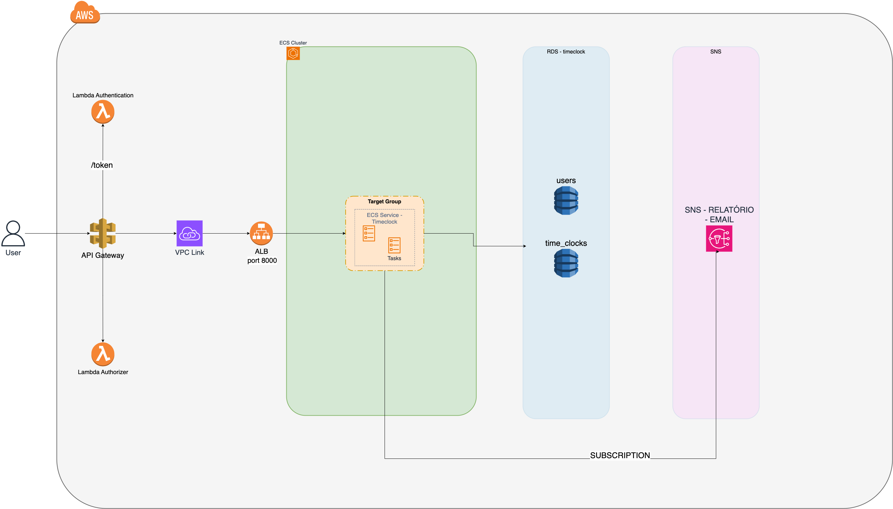
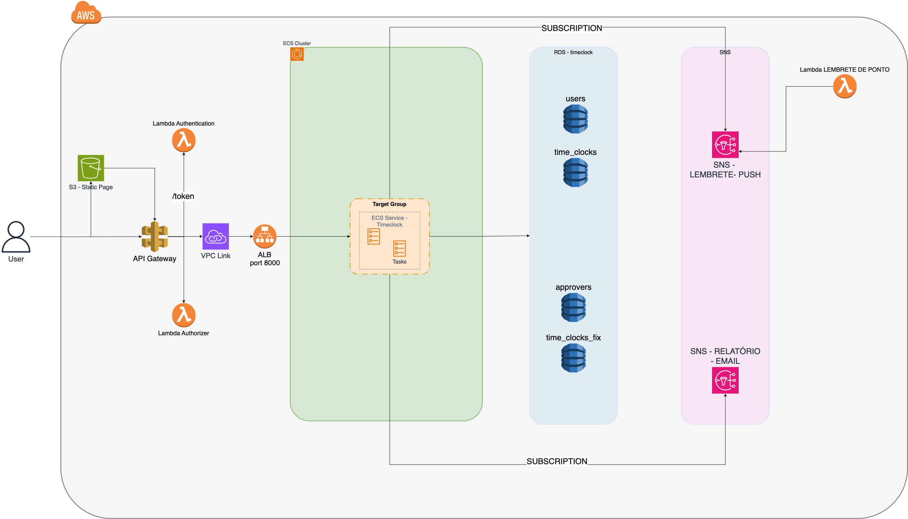

# HACKATON SOAT2 GRUPO 16

## Integrantes:
- Pedro Vitor Jhum Haramoto
- Jorge Eugenio Souza de Melo
- Joao Vitor Campari Racchetti
- Thiago Oliveira Camargo

 <a href="#sobre">Sobre</a> •
 <a href="#como-executar">Como Executar</a> •
 <a href="#como-executar-testes">Como Executar Testes</a> •
 <a href="#como-visualizar-o-swagger">Como Visualizar o Swagger</a> •

## Sobre
Time Clock API: Sistema de ponto eletrônico para controle de horas trabalhadas.

## Como Executar

Um makefile é disponibilizado para ajudar com algumas atividades rotineiras, para checar a lista de receitas disponíveis, basta acessar o [makefile aqui](./Makefile) ou simplesmente, na raiz do projeto, executar o comando `make help`.

Execute `make build-all` e em seguida `make run-all`, para executar todas as imagens necessárias e subir o projeto localmente. Caso deseje executar somente o banco de dados, é possível através da receita `make run-db` (também após o `make build-all`).

## Como Executar Testes

Esse projeto atualmente possui testes unitários e de integração, para executar todos, é necessário que ao menos o container do banco de dados esteja disponível (para saber como, veja a seção: [Como Executar](#como-executar)).

Após isso, basta executar o comando `make test`, que fará com que a base de dados atual seja recriada (para execução dos testes de integração) e os testes sejam executados.

## Como Visualizar o Swagger

Este projeto conta com Swagger para especificação e documentação da API. Para visualizar, basta executar localmente o projeto, como indicado na seção [Como Executar](#como-executar). E então acessar o link abaixo:

`http://localhost:8000/swagger/index.html`

## Entregáveis mínimos
### Desenho de solução MVP

### Desenho da solução evolutiva (FASE 2)

### Demonstração da infra na cloud / Demonstração da esteira de CI/CD / Demonstração do MVP
- Link para o vídeo da demonstração do MVP: [Vídeo](https://www.youtube.com/watch?v=bJHLvNFdpAo)

## Outros repositórios
- [Lambda Authentication](https://github.com/postech-soat2-grupo16/hackathon-lambda-authentication)
- [Lambda Authorization](https://github.com/postech-soat2-grupo16/hackathon-lambda-authorization)
- [Infra DB](https://github.com/postech-soat2-grupo16/hackathon-infra-db)
- [Infra SNS](https://github.com/postech-soat2-grupo16/hackathon-infra-sns)